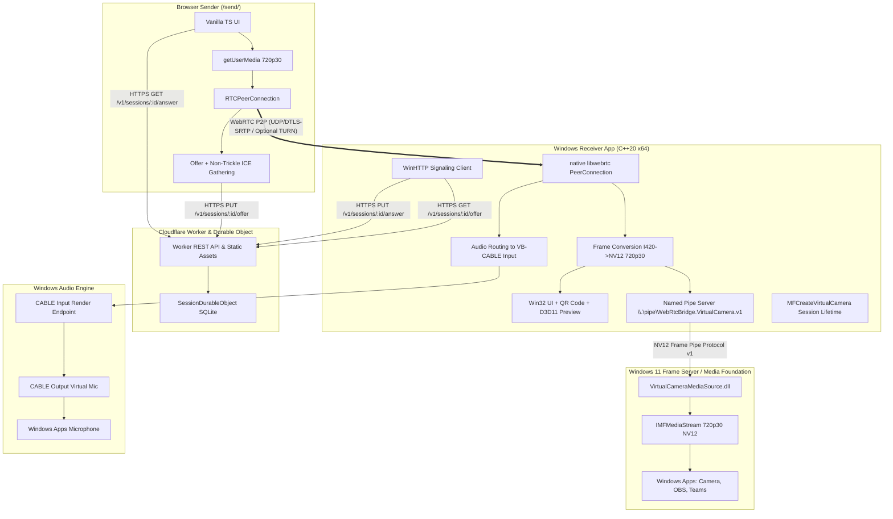

# WebRTC Windows 11 Virtual Camera PoC - Implementation Plan

## Goal Description

Build a fully functioning, production-grade Proof of Concept (PoC) for the **KM Virtual Camera** system:
- **Cloudflare Signaling**: Cloudflare Worker + SQLite-backed Durable Object providing short-lived session management, HTTPS REST API, Non-Trickle ICE SDP exchange, and Static Asset delivery.
- **Browser Sender**: Clean Vanilla TypeScript web application served from `/send/` that requests camera & microphone access, claims the session using a URL fragment Join Token, generates an Offer after full ICE gathering, and streams media to the receiver.
- **Windows Receiver**: C++20 desktop application (Win32, D3D11 preview, WinHTTP, native `libwebrtc`) that creates signaling sessions, displays local QR codes, polls and answers Offers, renders remote video in preview and sends frames via named pipe to the virtual camera, and routes audio to VB-CABLE (`CABLE Input`).
- **Windows 11 Virtual Camera**: Custom Media Foundation Media Source DLL registered with `MFCreateVirtualCamera` (Session Lifetime, Current User access), receiving 720p30 NV12 frames via high-performance overlapped named pipe IPC, rendering black frames when disconnected/stale, and providing seamless virtual camera access to Windows apps (Camera app, OBS, Teams, Zoom, browsers).



---

## User Review Required

> [!IMPORTANT]
> **Key Architecture Decisions & Strict Invariants**
> 1. **Signaling Simplicity**: Non-Trickle ICE (complete SDP exchange), HTTPS REST + polling, 5-minute fixed session lifetime, 60-second connection timeout, 1 Sender / 1 Receiver / 1 Session.
> 2. **Token Security**: Join Token in URL fragment (`#v=1&s=...&j=...`), sanitized immediately via `history.replaceState()`, stored in `sessionStorage` only, never logged or sent via query params.
> 3. **Native Media Source Isolation**: `VirtualCameraMediaSource.dll` operates in the Windows Frame Server process and has **zero** dependencies on `libwebrtc` or network APIs; it communicates exclusively with Receiver.exe via byte-mode overlapped Named Pipe (`specs/frame_pipe_protocol.md`).
> 4. **Audio Routing Model**: Receiver outputs received Opus audio directly to user-selected Windows render endpoint (`CABLE Input`), which feeds downstream apps (`CABLE Output`).

> [!NOTE]
> **Environment Verification**:
> - OS: Windows 11 x64
> - Compiler: Visual Studio 2022 Community (MSVC 14.43 / 14.42), C++20
> - Windows SDK: 10.0.22621.0 / 10.0.26100.0 (includes `mfvirtualcamera.h` and Media Foundation APIs)
> - Node.js: v22.x / npm / npx installed
> - Git: installed

---

## Proposed Implementation Plan by Milestone

### Milestone 0: Repository Layout, Toolchain & Locks

1. **Workspace Root Structure**:
   - Move/organize docs and specifications from `docs/prepare/` into root `docs/`, `specs/`, `checklists/`.
   - Create root `README.md`, `SECURITY.md`, `THIRD_PARTY_NOTICES.md`, `LICENSE`.
   - Create initial tracking documents:
     - `IMPLEMENTATION_STATUS.md`: milestones, completed items, blockers, test logs.
     - `KNOWN_ISSUES.md`: verified issues and constraints.
2. **WebRTC Dependency Lock**:
   - Create `windows/third_party/webrtc-lock.json` pinning compatible commit SHA, GN args, Visual Studio 2022 and Windows SDK 10.0.22621 requirements.
   - Create `scripts/build-libwebrtc.ps1` for reproducible building/fetching.
3. **Windows CMake & Cloud Toolchain Setup**:
   - `cloud/`: configure `package.json`, `tsconfig.json`, `wrangler.jsonc`, `vitest.config.ts`.
   - `windows/`: configure `CMakeLists.txt` with C++20, `/W4`, Media Foundation (`mf.lib`, `mfplat.lib`, `mfuuid.lib`), D3D11 (`d3d11.lib`, `dxgi.lib`), WinHTTP (`winhttp.lib`), CoreAudio (`ole32.lib`, `mmdevapi.lib`), and CTest unit test targets.

---

### Milestone 1: Cloudflare Signaling (Worker & Durable Object)

Implement the full `specs/openapi.yaml` specification in `cloud/`:
- **HTTP Router & Endpoints**:
  - `GET /v1/health`
  - `POST /v1/sessions` (creates 5-min session, generates 16-byte base64url `sessionId`, 32-byte `receiverToken` and `joinToken`, builds `#` fragment Join URL)
  - `POST /v1/sessions/:sessionId/claim` (authenticates Join Token, handles `claimNonce` idempotency via HMAC, issues `senderToken`)
  - `PUT /v1/sessions/:sessionId/offer` (authenticates Sender Token, validates 128KB max SDP, transitions to `OFFER_READY`)
  - `GET /v1/sessions/:sessionId/offer` (authenticates Receiver Token, returns 204 with `Retry-After: 1` if pending, or 200 with Offer SDP)
  - `PUT /v1/sessions/:sessionId/answer` (authenticates Receiver Token, stores Answer SDP, transitions to `ANSWER_READY`)
  - `GET /v1/sessions/:sessionId/answer` (authenticates Sender Token, returns 204 or 200 with Answer SDP)
  - `DELETE /v1/sessions/:sessionId` (best-effort deletion)
- **SessionDurableObject**:
  - SQLite-backed state storage.
  - Alarms configured at creation for exact 300s TTL (no TTL extension on polling).
  - Storage deletion on alarm and delete.
  - Role-based token hash authentication & timing-safe checks.
- **Security & Headers**:
  - Strict `Cache-Control: no-store, max-age=0`, `Referrer-Policy: no-referrer`, `X-Request-ID`.
  - CSP for Static Assets: `default-src 'self'; script-src 'self'; style-src 'self'; img-src 'self' blob:; media-src 'self' blob:; connect-src 'self';`.
  - Secrets redaction filter for logging.
- **Automated Tests**:
  - Implement full test suite in `cloud/test/` covering CF-001 through CF-022.

---

### Milestone 2: Browser Sender Application

Implement the lightweight, zero-dependency browser sender in `cloud/web/`:
- **UI & Lifecycle**:
  - Responsive, clean interface: camera/microphone selection, local preview `<video playsinline muted>`, Start/Stop buttons, connection status, diagnostics drawer.
  - Parse `#v=1&s=...&j=...` from URL fragment on load, save to `sessionStorage`, clear hash from URL bar using `history.replaceState`.
- **Media & WebRTC**:
  - `getUserMedia({ video: { width: { ideal: 1280 }, height: { ideal: 720 }, frameRate: { ideal: 30 } }, audio: true })`.
  - Claim session on Start after media permission granted.
  - Add transceivers as `direction: "sendonly"`.
  - Generate Offer, wait for ICE gathering `complete` (with 15s timeout), PUT complete Offer SDP.
  - Poll `/v1/sessions/:sessionId/answer` with backoff (1s -> 2s, 60s total timeout).
  - Apply Answer with `setRemoteDescription`.
  - Monitor `connectionstatechange`, track status, collect periodic WebRTC stats (`getStats`).
  - Clean teardown on Stop or window unload.

---

### Milestone 3: Windows Native Receiver Application

Implement the C++20 Win32 Receiver in `windows/receiver/`:
- **Win32 UI & Preview**:
  - Modern Win32 application window.
  - Local QR code generation and display (using clean Nayuki QR code generator).
  - D3D11 swap chain video preview rendering NV12/BGRA frames.
  - Audio output dropdown and Virtual Camera toggle status.
- **Signaling Client**:
  - WinHTTP-based client with HTTPS certificate validation, timeouts, request ID tracking, and JSON DTO parser.
  - Session creation and background polling worker for Offer.
- **WebRTC PeerConnection Client**:
  - Native `libwebrtc` factory, network/worker/signaling threads.
  - SetRemoteDescription(Offer) -> CreateAnswer -> SetLocalDescription -> wait gathering complete -> PUT Answer.
  - `VideoSinkInterface<webrtc::VideoFrame>` feeding the frame conversion worker.
- **Video Conversion & Pipeline**:
  - Thread-safe latest-frame slot with non-blocking drop semantics.
  - I420/RGB to NV12 1280x720 30fps conversion with aspect-fit letterbox and rotation handling.
  - Publish converted NV12 frames to pipe publisher and D3D11 preview.

---

### Milestone 4: VB-CABLE Audio Routing

Implement audio device routing in `windows/receiver/rtc/audio_device_selector.*`:
- **Endpoint Enumeration**:
  - Enumerate Windows WASAPI render endpoints using `IMMDeviceEnumerator`.
  - Detect and match `CABLE Input (VB-Audio Virtual Cable)`.
  - Persist user preference in `config.json`.
- **Audio Playout & Fallback**:
  - Direct `libwebrtc` AudioDeviceModule to output to the selected endpoint.
  - Implement WASAPI shared-mode renderer fallback with bounded PCM ring buffer if ADM routing requires custom injection.
  - Prevent duplicate speaker playout / acoustic feedback loops.

---

### Milestone 5: Windows 11 Virtual Camera

Implement the custom Media Foundation Virtual Camera in `windows/virtual-camera/`:
- **Media Source DLL (`VirtualCameraMediaSource.dll`)**:
  - COM class factory and registration (`InProcServer32`, `ThreadingModel=Both`).
  - `IMFMediaSource` & `IMFMediaStream` exposing single 1280x720 30fps NV12 media type.
  - Background named pipe client connecting to `\\.\pipe\WebRtcBridge.VirtualCamera.v1` with overlapped I/O.
  - Frame Pipe Protocol v1 parser: exact 64-byte `FrameHeader` verification (magic `WRTCVF01`, version 1, 1280x720 NV12 stride 1280, 1382400 bytes payload).
  - 30fps frame pacing with rational accumulator (`frameIndex * 10000000 / 30`).
  - Automatic fallback to NV12 black frames when pipe is disconnected or frames are stale (>2s).
- **Registrar & Lifecycle Controller**:
  - Receiver calls `MFCreateVirtualCamera(MFVirtualCameraType_SoftwareCameraSource, MFVirtualCameraLifetime_Session, MFVirtualCameraAccess_CurrentUser, ...)` to publish the camera.
  - Camera automatically unregisters on app exit / shutdown.
- **Dev Scripts**:
  - `scripts/install-vcam-dev.ps1`: copies DLL and registers COM CLSID in current user / system registry.
  - `scripts/uninstall-vcam-dev.ps1`: unregisters COM CLSID and cleans up.
- **Test Harness**:
  - `windows/virtual-camera/tests/media_source_test_harness.cpp`: in-process loader verifying sample requests, timestamp pacing, black frame generation, and pipe streaming.

---

### Milestone 6: Hardening, Integration Testing & Verification

1. **Diagnostics & Security**:
   - Structured JSONL logs with automatic redaction of Tokens, SDPs, and credentials.
   - 30-minute continuous soak test verification.
2. **Acceptance Checklist**:
   - Execute all verification items in `checklists/ACCEPTANCE_CHECKLIST.md`.
   - Update `IMPLEMENTATION_STATUS.md` and `KNOWN_ISSUES.md`.
3. **Build & Test Scripts**:
   - Verify `scripts/bootstrap-cloud.ps1`, `scripts/build-windows.ps1`, `scripts/test-all.ps1`.

---

## Verification Plan

### Automated Tests
1. **Cloud & Signaling**:
   ```powershell
   cd cloud
   npm test
   ```
   *Expected*: All 22 tests (CF-001 through CF-022) pass, testing session creation, claim, offer/answer polling, rate limiting, expiry alarm, header security.
2. **Windows Receiver & Virtual Camera**:
   ```powershell
   .\scripts\build-windows.ps1 -Configuration Release
   ctest --test-dir windows/build -C Release --output-on-failure
   ```
   *Expected*: Unit tests for signaling DTOs, frame pipe protocol serialization, NV12 conversion, audio device matching, and Media Source test harness pass.

### Manual Verification Flow (E2E)
1. **Launch Cloud Signaling & Sender Page**:
   - Run `npx wrangler dev` in `cloud/`.
2. **Register Virtual Camera DLL (Dev)**:
   - Run `.\scripts\install-vcam-dev.ps1`.
3. **Start Windows Receiver**:
   - Launch `windows/build/bin/Release/Receiver.exe`.
   - Verify Session is created, Join URL QR code is displayed, and Audio Output lists `CABLE Input`.
4. **Open Browser Sender**:
   - Open Join URL in Chrome / Edge (or mobile browser via QR).
   - Grant camera/mic permissions, press "Start".
   - Confirm local preview video is active and status turns to "Connected".
5. **Verify Windows Receiver Output**:
   - Verify remote video is rendered smoothly in Receiver D3D11 preview window.
   - Open Windows **Camera App** or **OBS Studio**; select `WebRTC Bridge Windows Virtual Camera` and verify 720p30 remote video feed.
   - Check sound settings / downstream recording app with `CABLE Output` and verify remote audio stream.
6. **Teardown**:
   - Close Receiver; verify Virtual Camera automatically disappears from Windows camera devices.
